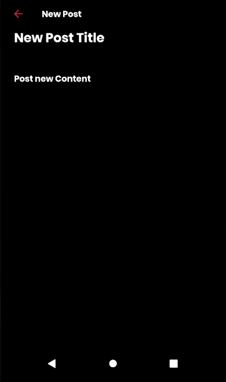
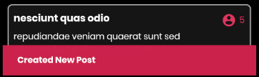
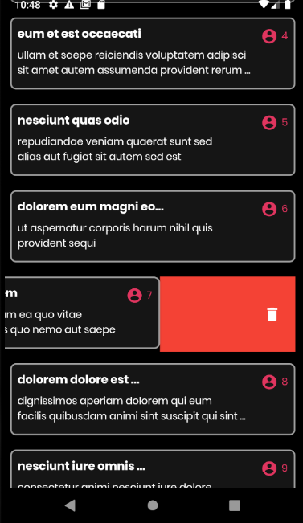
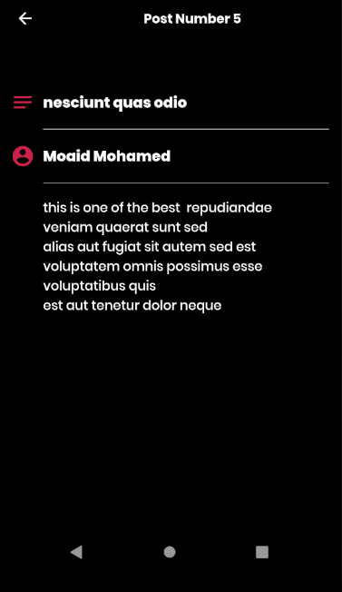
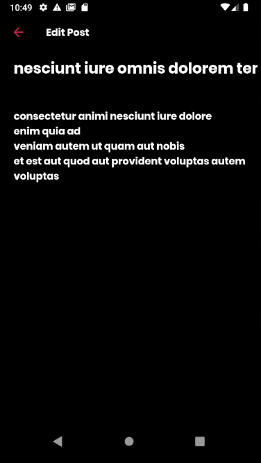

# flutter_jsonplaceholder

A flutter blog app built with stacked Mvvm architecture.

<h2> Home Page </h2>
 
</img>
 
<h2> Add Post form </h2>
</img>

<h2> Add Post with content </h2>
</img>
   
<h2> Alert of create Post </h2>
 
</img>
    
<h2> Delete Post </h2>
 
</img>
     
<h2> Undo Deletion </h2>
 
</img>
      
<h2> Single Post Details </h2>
 
</img>

<h2> Edit Post</h2>
 
</img>

